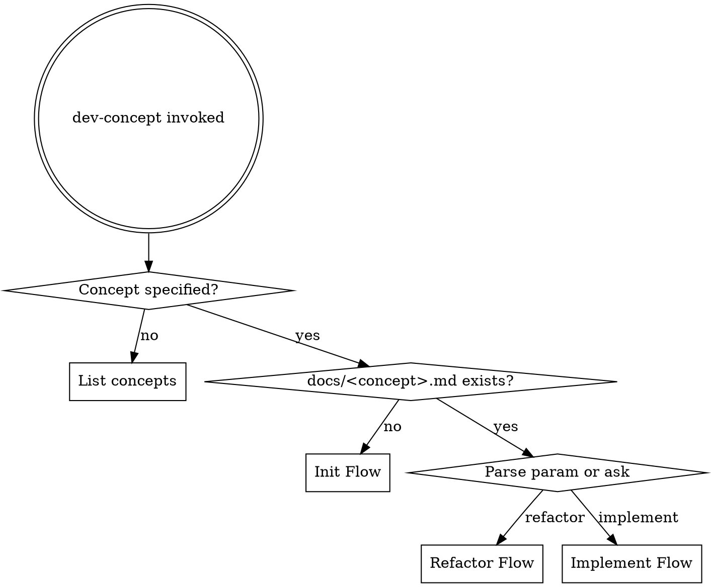

# Dev Concept

## Overview

Generalized orchestrator for learning and applying development concepts to real projects. Uses thin reference files for key rules + runtime research for stack-specific details.

## Parameters

```
/dev-concept                          — list available concepts
/dev-concept saga-pattern             — apply saga pattern
/dev-concept caching-strategies       — apply caching strategies
/dev-concept <name> refactor payments — refactor target with concept
```

## Available Concepts

List from `~/.claude/command-scripts/knowledge/dev-concept/`:

| Tier | Name | Description |
|------|---------|-------------|
| 1 | event-driven | 이벤트 기반 아키텍처, pub/sub, 도메인 이벤트 |
| 1 | queue-patterns | Message queue (retry, DLQ, idempotency, backpressure) |
| 1 | caching-strategies | Cache-aside, write-through, invalidation, TTL |
| 1 | api-design | REST 성숙도, 버저닝, pagination, idempotency key |
| 2 | ddd-architecture | Domain-Driven Design, 바운디드 컨텍스트, 애그리거트 |
| 2 | cqrs | Command Query Responsibility Segregation |
| 2 | websocket | WebSocket 설계, 연결 관리, 스케일링 |
| 2 | saga-pattern | 분산 트랜잭션, 보상 트랜잭션 |
| 2 | circuit-breaker | Resilience 패턴 (circuit breaker, retry, bulkhead) |
| 3 | db-optimization | 쿼리 최적화, 인덱싱, N+1, 파티셔닝 |
| 3 | observability | 메트릭/로그/트레이스 설계, 알림 전략 |
| 3 | event-sourcing | 상태 대신 이벤트 저장, 리플레이 |
| 3 | contract-testing | API 계약 테스트, 소비자 주도 테스트 |

No argument → 위 테이블 출력 후 사용자 선택.

## Flow Detection



## Init Flow

First-time setup for a concept in this project. Analyzes codebase and designs application strategy.

| Step | Tool | Action |
|------|------|--------|
| 1 | — | Load reference file: `~/.claude/command-scripts/knowledge/dev-concept/<concept>.md` |
| 2 | `/sc:analyze` | Analyze current codebase — find existing code related to the concept |
| 3 | `/sc:research` + context7 MCP | Research concept implementation for detected stack (Django, Celery, Redis, etc.) |
| 4 | `/sc:design` | Design concept application interactively — conventions, boundaries, implementation strategy |
| 5 | `/sc:spec-panel` | Multi-expert review of the design |
| 6 | — | Generate `docs/<concept>.md` (project-specific artifact) |
| 7 | — | Add pointer to project CLAUDE.md |

**CLAUDE.md pointer (added once):**
```markdown
## [Concept Name]
- See `docs/<concept>.md` for conventions.
- Use `/dev-concept <concept>` for related work.
```

**Project artifact template:**
```markdown
# [Concept Name] — {project name}

## Tech Stack
- Language: {detected}
- Framework: {detected}
- Related infra: {detected}

## Conventions
{project-specific decisions from Init Flow}

## Applied Instances
| Date | Target | Description | Status |
|------|--------|-------------|--------|

## Change Log
| Date | Target | Change | Flow |
|------|--------|--------|------|
```

## Refactor Flow

Restructure existing code to follow the concept.

| Step | Tool | Action |
|------|------|--------|
| 1 | — | Load reference file + project artifact (`docs/<concept>.md`) |
| 2 | — | Confirm refactoring target (from param or ask user) |
| 3 | Serena `find_symbol` + `find_referencing_symbols` | Map current code — dependencies, side effects |
| 4 | `superpowers:brainstorming` → `superpowers:writing-plans` | Design and plan refactoring steps |
| 5 | — | **실행 방법 선택:** A) `superpowers:subagent-driven-development` B) `superpowers:test-driven-development` (Guided TDD) |
| 6 | `/sc:reflect` | Verify concept compliance |
| 7 | — | Update project artifact Change Log |

## Implement Flow

Build new features following the concept's conventions.

| Step | Tool | Action |
|------|------|--------|
| 1 | — | Load reference file + project artifact (`docs/<concept>.md`) |
| 2 | — | Confirm feature to implement (from param or ask user) |
| 3 | `/sc:design` | Design concept-aligned structure for the feature |
| 4 | `superpowers:brainstorming` → `superpowers:writing-plans` | Design and plan implementation steps |
| 5 | — | **실행 방법 선택:** A) `superpowers:subagent-driven-development` B) `superpowers:test-driven-development` (Guided TDD) |
| 6 | `/sc:reflect` | Verify concept compliance |
| 7 | — | Update project artifact Change Log |

## Learning Mode

When the user invokes with learning intent (e.g., "이 패턴 공부하고 싶어", "explain first"):

1. Load reference file — present key principles and decision guide
2. `/sc:explain` — explain the concept with codebase-relevant examples
3. `/sc:research` — fetch current best practices and real-world case studies
4. Ask: "코드베이스에 적용해볼까요?" → yes: proceed to Init/Refactor/Implement Flow

## Reference File Format

Each file in `~/.claude/command-scripts/knowledge/dev-concept/` follows:

```markdown
# [Concept Name]

## Key Principles
- (3-5 core rules)

## When to Use
- (triggers / symptoms that suggest this concept)

## Decision Guide
- (key architectural choices within the concept)

## Code Smells
- (code smells that indicate need for this concept)

## Common Mistakes
- (anti-patterns to avoid)

## Stack Hints (Django / Celery / Redis)
- (Python/Django stack specific notes with code examples)

## Stack Hints (Spring / Kotlin)
- (Kotlin/Spring stack specific notes with code examples)
```

Each reference file provides **dual-stack hints** (Django + Spring/Kotlin) to support both production work and the Python→Kotlin career transition.

## Notes

- Reference files provide offline key rules (~50 lines each)
- `/sc:research` fills in stack-specific implementation details at runtime
- Project artifact (`docs/<concept>.md`) accumulates project-specific decisions
- Multiple concepts can coexist in one project
