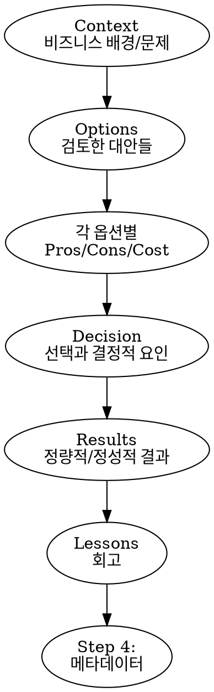

# TDR - Technical Decision Record

## Overview

면접용 Technical Decision Record를 Notion DB에 저장하는 스킬.
Claude가 **인터뷰어 관점**에서 Q&A를 진행하여 각 섹션을 채운다. 한국어로 작성.

## Pipeline

session-til → tdr 연결 흐름:

```
세션 중 인사이트 발견
    ↓
/session-til [gotcha|decision]   → Notion Dev Scraps에 빠르게 저장
    ↓ 저장 완료 후 "TDR로 만들까요?" 제안
/tdr → Session TIL 기반 모드     → 저장된 항목을 Context/Decision 초안으로 활용
    ↓
인터뷰어 관점 Q&A (Options/Results/Lessons 채우기)
    ↓
면접용 포트폴리오 완성
```

session-til이 "빠른 메모", tdr이 "면접용 정제" 역할.

## Notion DB

- **Database:** Technical Decision Records
- **Database ID:** `2fb41e61-65c0-8110-9a8c-d08cde96fc24`
- **Data Source ID:** `2fb41e61-65c0-81bb-ba97-000b9a63c13c`
- **Template ID:** `2fb41e61-65c0-8029-a97b-e718778c6c03` (default template)
- **API Version:** `2025-09-03`
- **API Key:** `NOTION_API_KEY` (from `~/.zshenv`)

**Properties:**

| 속성 | 타입 | 값 |
|------|------|-----|
| 제목 | title | 결정 제목 |
| 상태 | select | **항상 Draft** |
| 임팩트 | select | High / Medium / Low |
| 카테고리 | select | Migration / Scaling / Incident / Architecture |
| 작성일 | date | 오늘 날짜 |
| URL | url | 관련 Jira/PR 링크 (선택) |

## Process

### Step 1: 입력 모드 선택

AskUserQuestion으로 모드 선택:

```
어떤 소스를 기반으로 TDR을 작성할까요?
- Session TIL 기반 (Notion Dev Scraps의 TIL 항목에서 자동 추출)
- Jira 티켓 기반 (티켓에서 Context 자동 추출)
- Jira + GitHub PR 기반 (티켓 + PR에서 Context/Decision 추출)
- 대화 기반 (소스 없이 Q&A로 작성)
```

### Step 2: 소스 파싱 (Mode 1, 2, 3만 해당)

**Mode 1 - Session TIL:**

Dev Scraps DB에서 `주제 = Session TIL`인 최근 항목을 조회하여 사용자가 선택:

```bash
source ~/.zshenv
notion_key=$(printenv NOTION_API_KEY)

curl -s -X POST "https://api.notion.com/v1/databases/76e9673e-d91b-41b2-9779-c0940040f542/query" \
  -H "Authorization: Bearer $notion_key" \
  -H "Content-Type: application/json" \
  -H "Notion-Version: 2022-06-28" \
  -d '{
    "filter": { "property": "주제", "select": { "equals": "Session TIL" } },
    "sorts": [{ "property": "작성일", "direction": "descending" }],
    "page_size": 10
  }' | jq '[.results[] | {id: .id, title: .properties["제목"].title[0].plain_text, date: .properties["작성일"].date.start}]'
```

조회된 페이지 목록을 사용자에게 보여주고 AskUserQuestion으로 선택받기.

선택된 페이지의 블록을 조회하여 toggle 항목(의사결정/갓챠) 목록 추출:

```bash
curl -s "https://api.notion.com/v1/blocks/<PAGE_ID>/children?page_size=100" \
  -H "Authorization: Bearer $notion_key" \
  -H "Notion-Version: 2022-06-28" \
  | jq '[.results[] | select(.type == "toggle") | {id: .id, title: (.toggle.rich_text[0].plain_text)}]'
```

항목이 여러 개면 AskUserQuestion으로 어떤 항목을 TDR로 만들지 선택받기.

선택된 toggle의 children(상황/선택/근거 또는 Before/After/So What)을 읽어 TDR Context/Decision 초안으로 변환:

```bash
curl -s "https://api.notion.com/v1/blocks/<TOGGLE_ID>/children" \
  -H "Authorization: Bearer $notion_key" \
  -H "Notion-Version: 2022-06-28" \
  | jq '[.results[].bulleted_list_item.rich_text | map(.plain_text) | join("")]'
```

추출한 내용을 섹션에 매핑:
- `상황` → Context 초안
- `선택` + `근거` → Decision 초안
- `Before` + `After` → Context 초안 (갓챠인 경우)
- `So What` → Lessons 초안

**Mode 2 - Jira:**
- Jira REST API로 티켓 파싱
- 티켓 제목, 설명, 댓글에서 Context 초안 생성

**Mode 3 - Jira + PR:**
- Jira 파싱 + `gh pr view <URL>` 로 PR 파싱
- Context (Jira) + Decision 힌트 (PR description, 변경 파일) 추출

**Mode 4 - 대화:**
- 바로 Step 3으로 진행

### Step 3: 인터뷰어 관점 Q&A

**반드시 한 번에 1개 질문만.** 소스에서 이미 파악된 내용은 요약 제시 후 확인만.



**질문 예시 (인터뷰어 톤):**

| 섹션 | 질문 |
|------|------|
| Context | "이 작업이 필요했던 비즈니스 배경이 뭐였나요? 왜 이 시점에?" |
| Options | "어떤 대안들을 검토했나요?" |
| 각 옵션 | "이 옵션의 장단점과 예상 비용은?" |
| Decision | "최종적으로 왜 이걸 선택했나요? 결정적 요인이 뭐였나요?" |
| Results | "정량적 결과가 있나요? 응답시간, 장애율, 비용 변화 등" |
| Lessons | "다시 한다면 뭘 다르게 하겠어요? 예상 못한 문제는?" |

**Results/Lessons가 아직 없는 경우:** "아직 결과가 없다면 비워둘게요. 나중에 Notion에서 추가하세요."

### Step 4: 메타데이터

내용 기반으로 Claude가 **추천**하고 AskUserQuestion으로 확인:

- **카테고리** — 내용에서 추론 (Migration/Scaling/Incident/Architecture)
- **임팩트** — 내용에서 추론 (High/Medium/Low)
- **관련 URL** — Jira/PR URL이 있으면 자동 채움, 없으면 물어봄

### Step 5: (선택) AI 리뷰로 품질 강화

Q&A 완료 후 AskUserQuestion으로 리뷰 옵션 제안:

```
TDR 초안이 완성되었습니다. AI 리뷰로 품질을 높일까요?
- 전문가 패널 리뷰 (/sc:spec-panel) — 면접 설득력 관점에서 TDR 전체 리뷰
- 비즈니스 임팩트 강화 (/sc:business-panel) — Context/Decision의 비즈니스 프레이밍 강화
- 둘 다
- 건너뛰기 — 바로 미리보기로 이동
```

**sc:spec-panel 사용 시:**
- TDR 전문을 입력으로 전달
- "면접에서 이 기술 결정을 설명할 때 설득력 있는가?" 관점으로 리뷰 요청
- 피드백 반영 후 다음 단계로

**sc:business-panel 사용 시:**
- Context, Decision 섹션을 입력으로 전달
- 비즈니스 임팩트/가치를 더 명확하게 표현하도록 개선 제안 요청
- 피드백 반영 후 다음 단계로

### Step 6: 미리보기 & 확인

완성된 TDR 전문을 마크다운으로 보여줌:

```
# [TDR 제목]

카테고리: Migration | 임팩트: High | 작성일: 2026-02-03

## Context (상황)
...

## Options (선택지)
| Option | Pros | Cons | Cost |
|--------|------|------|------|
| ... | ... | ... | ... |

## Decision (결정)
...

## Results (결과)
...

## Lessons (회고)
...
```

사용자 확인 후 저장. 수정 요청 가능.

### Step 7: Notion에 저장

Template 기반 2-phase 저장. Template이 구조(heading 색상, 빈 줄 spacer, 테이블)를 제공하고, 실제 내용만 업데이트.

```bash
API_KEY=$(grep -E '^export NOTION_API_KEY=' ~/.zshenv | cut -d'=' -f2)
DS_ID="2fb41e61-65c0-81bb-ba97-000b9a63c13c"
TEMPLATE_ID="2fb41e61-65c0-8029-a97b-e718778c6c03"
TODAY=$(date +%Y-%m-%d)
```

#### Phase 1: 페이지 생성 (Template 기반)

```bash
curl -s -X POST "https://api.notion.com/v1/pages" \
  -H "Authorization: Bearer $API_KEY" \
  -H "Content-Type: application/json" \
  -H "Notion-Version: 2025-09-03" \
  -d '<PAYLOAD>'
```

**Payload 구조:**

```json
{
  "parent": { "data_source_id": "<DS_ID>" },
  "template": { "type": "template_id", "template_id": "<TEMPLATE_ID>" },
  "properties": {
    "제목": { "title": [{ "text": { "content": "<TITLE>" } }] },
    "상태": { "select": { "name": "Draft" } },
    "임팩트": { "select": { "name": "<IMPACT>" } },
    "카테고리": { "select": { "name": "<CATEGORY>" } },
    "작성일": { "date": { "start": "<TODAY>" } },
    "URL": { "url": "<URL_OR_NULL>" }
  }
}
```

**IMPORTANT:** `children` 블록을 payload에 포함하지 않음. Template이 비동기로 블록을 생성함.

#### Phase 2: Template 블록 업데이트

Template 블록이 비동기로 적용되므로 **3초 대기** 후 블록을 조회하고 업데이트.

```bash
sleep 3
curl -s "https://api.notion.com/v1/blocks/<PAGE_ID>/children?page_size=100" \
  -H "Authorization: Bearer $API_KEY" \
  -H "Notion-Version: 2025-09-03"
```

**Template 블록 구조 (15 blocks):**

```
 0: heading_2 "Context (상황)" [yellow_background]
 1: paragraph placeholder [gray]      ← 업데이트 대상
 2: paragraph (empty spacer)           ← 유지
 3: heading_2 "Options (선택지)" [yellow_background]
 4: table (4 cols, header only)        ← 삭제 후 새 테이블 추가
 5: paragraph (empty spacer)           ← 유지
 6: heading_2 "Decision (결정)" [yellow_background]
 7: paragraph placeholder [gray]      ← 업데이트 대상
 8: paragraph (empty spacer)           ← 유지
 9: heading_2 "Results (결과)" [yellow_background]
10: paragraph placeholder [gray]      ← 업데이트 대상
11: paragraph (empty spacer)           ← 유지
12: heading_2 "Lessons (회고)" [yellow_background]
13: paragraph placeholder [gray]      ← 업데이트 대상
14: paragraph (empty spacer)           ← 유지
```

**블록 업데이트 방법:**

1. **단순 섹션** (Context, Decision, Results, Lessons): placeholder paragraph를 실제 내용으로 업데이트

```bash
curl -s -X PATCH "https://api.notion.com/v1/blocks/<BLOCK_ID>" \
  -H "Authorization: Bearer $API_KEY" \
  -H "Content-Type: application/json" \
  -H "Notion-Version: 2025-09-03" \
  -d '{"paragraph": {"rich_text": [{"text": {"content": "<ACTUAL_CONTENT>"}}]}}'
```

2. **다중 paragraph 섹션**: 첫 번째 paragraph 업데이트 후, 추가 블록은 spacer 앞에 삽입

```bash
curl -s -X PATCH "https://api.notion.com/v1/blocks/<PAGE_ID>/children" \
  -H "Authorization: Bearer $API_KEY" \
  -H "Content-Type: application/json" \
  -H "Notion-Version: 2025-09-03" \
  -d '{"children": [<ADDITIONAL_BLOCKS>], "after": "<PREV_BLOCK_ID>"}'
```

3. **Options 테이블**: template 테이블 삭제 → heading 뒤에 실제 데이터 테이블 삽입

```bash
# 삭제
curl -s -X DELETE "https://api.notion.com/v1/blocks/<TEMPLATE_TABLE_ID>" \
  -H "Authorization: Bearer $API_KEY" \
  -H "Notion-Version: 2025-09-03"

# 새 테이블 삽입 (heading 뒤에)
curl -s -X PATCH "https://api.notion.com/v1/blocks/<PAGE_ID>/children" \
  -H "Authorization: Bearer $API_KEY" \
  -H "Content-Type: application/json" \
  -H "Notion-Version: 2025-09-03" \
  -d '{"children": [<TABLE_BLOCK>], "after": "<OPTIONS_HEADING_ID>"}'
```

**Options 테이블 블록 구조:**

```json
{
  "object": "block", "type": "table",
  "table": {
    "table_width": 4, "has_column_header": true, "has_row_header": false,
    "children": [
      { "type": "table_row", "table_row": { "cells": [
        [{ "text": { "content": "Option" } }],
        [{ "text": { "content": "Pros" } }],
        [{ "text": { "content": "Cons" } }],
        [{ "text": { "content": "Cost" } }]
      ] } },
      { "type": "table_row", "table_row": { "cells": [
        [{ "text": { "content": "<OPT_NAME>" } }],
        [{ "text": { "content": "<PROS>" } }],
        [{ "text": { "content": "<CONS>" } }],
        [{ "text": { "content": "<COST>" } }]
      ] } }
    ]
  }
}
```

### Step 8: 결과 출력

```
TDR이 Notion에 저장되었습니다:
- 제목: {title}
- 카테고리: {category} | 임팩트: {impact}
- URL: {notion_page_url}
- 상태: Draft (Notion에서 확인 후 Published로 변경하세요)
```

## Important Rules

- **한국어로 작성** — 모든 TDR 내용은 한국어
- **한 번에 1개 질문만** — 여러 질문을 한꺼번에 던지지 않음
- **항상 Draft 상태로 저장** — Published는 사용자가 Notion에서 수동 변경
- **인터뷰어 관점 질문** — 단순 정보 수집이 아닌, "왜?"를 파고드는 질문
- **Options 테이블은 4열** — Option / Pros / Cons / Cost
- **메타데이터는 추천 후 확인** — Claude가 내용 기반으로 추천, 사용자 확인
- **미리보기 필수** — 저장 전 반드시 전문 보여주고 확인 받기
- **Notion rich_text 2000자 제한** — 긴 내용은 여러 paragraph 블록으로 분할

## Error Handling

| 상황 | 대응 |
|------|------|
| NOTION_API_KEY 없음 | `~/.zshenv`에서 설정 안내 |
| 권한 오류 | Integration이 DB에 연결되어 있는지 확인 안내 |
| rich_text 2000자 초과 | 여러 paragraph 블록으로 분할 |
| Jira 파싱 실패 | 대화 모드로 전환 제안 |
