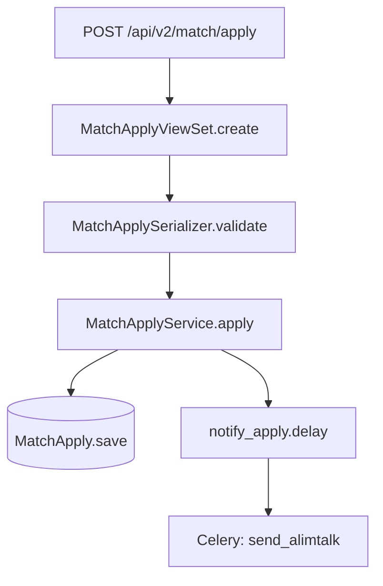

# PR Flow Visualizer

Produce a structured architectural overview of a PR: entry points, call flow, layer impact, and a Mermaid diagram.

## Input

PR URL (required). If not provided, ask for it.

## Process

### 1. Fetch PR Info

```bash
# Changed files
gh pr diff <pr-url> --name-only | cat

# Full diff
gh pr diff <pr-url> | cat

# PR title + description
gh pr view <pr-url> --json title,body,headRefName | jq .
```

### 2. Identify Entry Points

Scan changed files for these patterns:

| Pattern | Entry Point Type |
|---------|-----------------|
| `urlpatterns` / `router.register` | API Endpoint |
| `@shared_task` / `@app.task` / `.delay(` | Celery Task |
| `post_save` / `Signal` / `receiver(` | Django Signal |
| `management/commands/` | Management Command |
| `class.*View(` / `ViewSet` / `APIView` | View/ViewSet |
| `class.*Serializer(` | Serializer |
| `class.*Migration(` | DB Migration |
| `beat_schedule` | Scheduled Task |

### 3. Trace Call Flow

For each entry point, read its body and follow calls **only within changed files**. Do not trace into unchanged code — note the boundary with `→ [unchanged]`.

Identify which layers are touched:
```
API / View → Serializer → Service → Model → DB
                                  ↘ Task (async)
                                  ↘ Signal → Handler
```

### 4. Generate Output

#### Layer Impact Table
```
Layer            | Files | Changed?
API/View         |   2   | ██
Serializer       |   0   | ░░
Service          |   1   | ██
Model/Migration  |   2   | ██
Task/Async       |   1   | ██
```

#### Mermaid Diagram

Use `flowchart TD` for data flow, `sequenceDiagram` for request/response:



#### Key Changes Summary
- What new behavior is introduced
- What existing behavior changes
- Side effects (tasks triggered, signals fired, notifications sent)

## Output Format

```
## PR Overview: [Title] (#number)
Branch: feature/xxx → production

### Entry Points
- [API] `MatchApplyViewSet.create` — web/match/views.py
- [Task] `notify_apply` — match/tasks.py

### Flow Diagram
[Mermaid]

### Layer Impact
[Table]

### Key Changes
- ...
```

## Rules

- Trace **only changed files** — mark boundaries with `-> [unchanged]`
- If PR has >20 changed files, focus on the highest-impact files (entry points + core service)
- Use the repo's DOMAIN.md for business context if available
- Prefer `sequenceDiagram` when HTTP request/response is the main story
- Prefer `flowchart TD` for data transformation or state change flows

## Mermaid Label Rules (avoid parse errors)

- **No special unicode** in labels: replace `—` with `-`, `←/→` with `<-`/`->`, `≥/≤` with `>=`/`<=`
- **No parentheses** in bare node IDs (only inside quoted labels `["...()"]`)
- **No pipes** (`|`) inside quoted labels — use `/` instead
