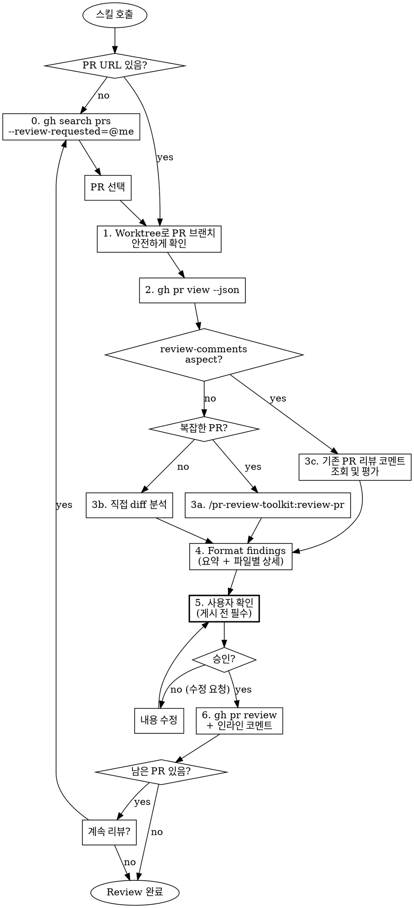
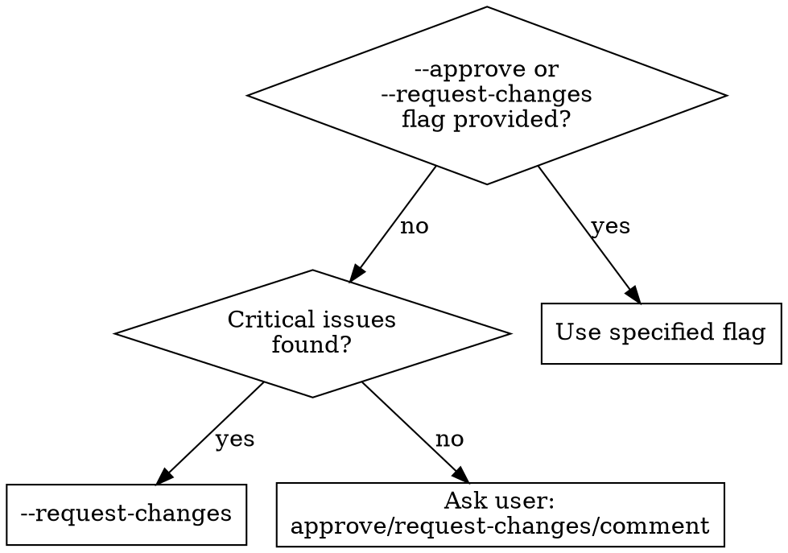

# GitHub PR Review

## Overview

PR URL을 받아서 worktree로 안전하게 코드 확인 → 코드 리뷰 → GitHub에 코멘트 게시까지 전체 워크플로우를 자동화합니다.

**핵심:** worktree를 사용하여 현재 브랜치에 영향 없이 PR 코드를 확인하고, `/pr-review-toolkit:review-pr`을 내부적으로 호출하여 리뷰를 수행하고, 결과를 GitHub PR에 자동으로 게시합니다.

**IMPORTANT:** `gh pr checkout`은 절대 사용하지 않는다. 현재 브랜치(production 등)에 영향을 주기 때문. 반드시 worktree 방식을 사용할 것.

## Arguments

```
/github-pr-review [<pr-url>] [review-aspects] [--approve|--request-changes|--comment|--list]
```

| Argument | Description | Default |
|----------|-------------|---------|
| `<pr-url>` | GitHub PR URL (optional) | - |
| `[aspects]` | `code`, `tests`, `errors`, `comments`, `types`, `simplify`, `review-comments`, `all` | `all` |
| `--approve` | Approve PR after review | - |
| `--request-changes` | Request changes if issues found | - |
| `--comment` | Just comment without approval decision | default |
| `--list` | 리뷰 대기 중인 PR 목록만 출력하고 종료 | - |

## First Action: Find Pending PRs

**PR URL 없이 스킬이 호출되면, 먼저 내가 리뷰어로 지정되어 있고 아직 approve하지 않은 PR 목록을 조회합니다.**

**`--list` 옵션:** PR 목록만 테이블 형태로 출력하고 종료합니다. 리뷰 진행 없이 현황 파악용.

```bash
# 내가 리뷰어인 열린 PR 조회 (pf-server-django, plabManagerApi, stadiumDjango)
gh search prs --state=open --review-requested=@me --repo=myplaycompany/pf-server-django --repo=myplaycompany/plabManagerApi --repo=myplaycompany/stadiumDjango --json number,title,url,repository,createdAt
```

조회 결과를 보여주고 사용자가 리뷰할 PR을 선택하도록 합니다.

### 리뷰 후 코드 수정 감지

**PR 목록 출력 시, 내가 이미 리뷰한 PR에 새 커밋이 있는지 확인합니다.**

```bash
# 각 PR에 대해 내 마지막 리뷰 이후 새 커밋이 있는지 확인
gh api repos/{owner}/{repo}/pulls/{pr_number}/reviews --jq '[.[] | select(.user.login=="kimwoz")] | last | .submitted_at'

# PR의 마지막 커밋 시간
gh pr view {pr_number} --json commits --jq '.commits[-1].committedDate'
```

**표시 방식:**
| 상태 | 표시 | 의미 |
|------|------|------|
| 🆕 | New | 아직 리뷰 안 함 |
| 🔄 | Updated | 내 리뷰 이후 새 커밋 있음 (재리뷰 필요) |
| ✅ | Reviewed | 리뷰 완료, 새 커밋 없음 |

## Workflow



## Process

### 0. Find Pending PRs (PR URL 없이 호출 시)

```bash
# 내가 리뷰어인 열린 PR 조회 (3개 레포)
gh search prs --state=open --review-requested=@me \
  --repo=myplaycompany/pf-server-django \
  --repo=myplaycompany/plabManagerApi \
  --repo=myplaycompany/stadiumDjango \
  --json number,title,url,repository,createdAt

# 결과 예시:
# [
#   {"number": 123, "title": "feat: 기능 추가", "url": "https://...", "repository": {"name": "pf-server-django"}, "createdAt": "2026-01-15T09:30:00Z"},
#   ...
# ]
```

**테이블 출력 형식:**

| 상태 | Repo | PR | Title | Created |
|------|------|-----|-------|---------|
| 🆕 | pf-server-django | #123 | feat: 기능 추가 | 2026-01-15 |
| 🔄 | plabManagerApi | #456 | fix: 버그 수정 | 2026-01-10 |

결과를 사용자에게 보여주고 리뷰할 PR 선택을 요청합니다.

### 1. Worktree로 PR 브랜치 확인

**`gh pr checkout` 사용 금지** — 현재 브랜치(production 등)에 영향을 줌. 반드시 worktree 사용.

```bash
# PR 정보에서 브랜치명 추출
BRANCH=$(gh pr view <pr-number> --json headRefName -q '.headRefName')
REPO_ROOT=$(git rev-parse --show-toplevel)
WORKTREE_PATH="$REPO_ROOT/.worktrees/pr-review-$BRANCH"

# 리모트 브랜치 fetch
git fetch origin "$BRANCH"

# Worktree 생성 (PR 브랜치)
git worktree add "$WORKTREE_PATH" "origin/$BRANCH" --detach

# Worktree에서 작업 (cd 하지 않고 -C 옵션 또는 파일 경로로 접근)
```

**리뷰 완료 후 worktree 정리:**
```bash
git worktree remove "$WORKTREE_PATH"
```

### 2. PR 정보 수집

```bash
# PR 기본 정보
gh pr view <pr-number> --json title,body,author,baseRefName,headRefName,number

# 변경된 파일 목록
gh pr diff <pr-number> --name-only

# PR 전체 diff
gh pr diff <pr-number>
```

**Note:** `gh pr view`/`gh pr diff`는 worktree 없이도 실행 가능. diff 기반 리뷰만 할 때는 worktree 없이 diff만으로도 충분.
Addressing Review Comments (fix action)에서 실제 코드 수정이 필요한 경우에만 worktree에서 작업.

### 3. Review 실행

#### `/pr-review-toolkit:review-pr` 호출 기준

| 조건 | 호출 여부 | 이유 |
|------|----------|------|
| 변경 파일 5개 이상 | ✅ 호출 | 복잡도 높음 |
| 변경 라인 100줄 이상 | ✅ 호출 | 분석량 많음 |
| 새 API 엔드포인트 추가 | ✅ 호출 | 설계 검토 필요 |
| 테스트 파일 변경 포함 | ✅ 호출 | 테스트 커버리지 분석 |
| 에러 핸들링 코드 변경 | ✅ 호출 | silent-failure-hunter 필요 |
| 단순 변수명/상수값 변경 | ❌ 직접 분석 | 간단함 |
| 1-2개 파일, 20줄 미만 | ❌ 직접 분석 | 오버헤드 불필요 |

**판단이 애매하면 호출한다.** 호출 비용보다 놓치는 이슈 비용이 더 크다.

#### `/pr-review-toolkit:review-pr` 스킬 활용

```
/pr-review-toolkit:review-pr [aspects]
```

| Aspect | Agent | Focus |
|--------|-------|-------|
| `code` | code-reviewer | CLAUDE.md 준수, 버그 탐지 |
| `tests` | pr-test-analyzer | 테스트 커버리지 |
| `errors` | silent-failure-hunter | 에러 핸들링 |
| `comments` | comment-analyzer | 소스 코드 주석 정확성 |
| `types` | type-design-analyzer | 타입 설계 |
| `simplify` | code-simplifier | 코드 간소화 |
| `review-comments` | (직접 분석) | 기존 PR 리뷰 코멘트 평가 |

**이 스킬의 역할:**
- PR checkout 처리
- `/pr-review-toolkit:review-pr` 호출하여 리뷰 실행
- 리뷰 결과를 GitHub PR에 게시

#### `review-comments` aspect (기존 PR 리뷰 코멘트 평가)

**`comments`(소스 코드 주석 분석)와 다르다.** `review-comments`는 다른 리뷰어가 남긴 PR 리뷰 코멘트를 조회하고 평가한다.

```bash
# PR의 모든 리뷰 코멘트 조회
gh api repos/{owner}/{repo}/pulls/{pr_number}/comments --jq '.[] | {id, user: .user.login, path, line, body, created_at}'

# PR의 일반 코멘트 (issue comments) 조회
gh api repos/{owner}/{repo}/issues/{pr_number}/comments --jq '.[] | {id, user: .user.login, body, created_at}'

# PR의 리뷰 조회 (approve/request-changes 등)
gh api repos/{owner}/{repo}/pulls/{pr_number}/reviews --jq '.[] | {id, user: .user.login, state, body, submitted_at}'
```

**평가 프로세스:**
1. 모든 리뷰 코멘트/리뷰를 조회
2. 각 코멘트의 해당 코드를 확인 (diff 기반)
3. 코멘트별 평가 출력:
   - 코멘트 내용 요약
   - 해당 코드 컨텍스트
   - 유효성 판단: 동의/부분 동의/반대 + 근거
   - 제안하는 대응 (수정/반론/무시 사유)
4. 사용자에게 대응 방법 확인 후, 필요 시 "Addressing Review Comments" 프로세스로 이어간다

**이 aspect는 코드를 직접 수정하지 않고 평가만 수행한다. 수정은 사용자 확인 후 별도로 진행.**

### 3.5. Safety Audits (optional)

**PR 변경 코드에 위험 패턴이 감지되면 자동으로 제안합니다.**

#### 3.5.1. Index Safety Check

마이그레이션 diff에 `AddIndex` 또는 `models.Index` 패턴이 감지되면:
> "인덱스 추가 마이그레이션이 감지되었습니다. `/ops:index-safety-check`로 암묵적 순서 의존 위험을 분석할까요?"

리포트 결과는 Step 4 리뷰 요약에 "Index Safety" 섹션으로 포함.

#### 3.5.2. Production Safety Audit

**PR 변경 코드에 인프라 의존 패턴이 감지되면 자동으로 제안합니다.**

감지 기준 (변경 파일 + 1-depth 의존 모듈에서):

| 코드 패턴 | 감지되는 인프라 |
|-----------|----------------|
| `redis`, `get_redis_client`, `Redis(` | Redis |
| `models.`, `objects.filter`, `migration` | RDS |
| `Elasticsearch`, `es.search` | Elasticsearch |
| `requests.get/post`, `httpx` | 외부 API |
| `@shared_task`, `.delay(` | Celery/Worker |

**하나 이상 감지 시:**
> "인프라 의존 코드 변경이 감지되었습니다 (Redis, RDS 등). `/ops:production-safety-audit --code-only`로 안전성 체크할까요?"

- `--code-only`: 코드 패턴만 체크 (AWS 인증 불필요, 빠름)
- 전체 감사: AWS CLI 인증 있으면 인프라 메트릭까지 조회 가능
- 결과는 Step 4 리뷰 요약에 "Infrastructure Safety" 섹션으로 포함

### 4. 결과 포맷팅

GitHub PR Review 형식으로 변환. **전체 요약 + 파일별 상세 코멘트** 2단 구조를 사용합니다.

```markdown
## Code Review Summary

### Critical Issues (must fix)
- **[file:line]** Issue description

### Important Issues (should fix)
- **[file:line]** Issue description

### Suggestions
- **[file:line]** Suggestion

### Strengths
- What's well-done

---

### File-by-File Details

<details>
<summary><code>src/api/views.py</code> (2 issues)</summary>

- 🔴 **L45:** Critical issue description
- ⚠️ **L120:** Important issue description
- 💡 **L88:** Suggestion

</details>

<details>
<summary><code>src/models.py</code> (1 issue)</summary>

- ⚠️ **L33:** Important issue description

</details>

<details>
<summary><code>tests/test_api.py</code> — OK</summary>

No issues found.

</details>

```

**규칙:**
- 변경된 **모든 파일**에 대해 `<details>` 섹션을 생성한다 (이슈가 없는 파일도 "OK"로 표시)
- 이슈가 있는 파일은 이슈 수를 summary에 표시
- 파일별 상세는 접힌 상태(`<details>`)로 유지하여 전체 요약의 가독성을 해치지 않는다

### 5. 사용자 확인 (게시 전 필수)

**리뷰 결과를 GitHub에 게시하기 전에, 반드시 사용자에게 내용을 보여주고 확인을 받는다.**

1. 전체 리뷰 내용 (요약 + 파일별 상세)을 사용자에게 출력
2. 인라인 코멘트 대상 목록 (파일, 라인, 내용) 출력
3. 사용자에게 확인 질문:
   - "이대로 GitHub에 게시할까요?"
   - 수정 요청 시 → 내용 수정 후 재확인
   - 승인 시 → 게시 진행

**절대 사용자 확인 없이 `gh pr review` 또는 인라인 코멘트 API를 실행하지 않는다.**

### 6. GitHub에 게시

```bash
# Request changes (critical issues 있을 때)
gh pr review --request-changes --body "$(cat review_body.md)"

# Approve (issues 없을 때)
gh pr review --approve --body "$(cat review_body.md)"

# Comment only (판단 보류)
gh pr review --comment --body "$(cat review_body.md)"
```

### 7. 인라인 코멘트 (특정 코드 라인에 코멘트)

**Critical/Important 이슈는 해당 코드 라인에 직접 인라인 코멘트를 추가합니다.**

```bash
# 1. 먼저 PR의 head commit SHA 조회
COMMIT_ID=$(gh pr view {pr_number} --json headRefOid -q '.headRefOid')

# 2. 특정 라인에 인라인 코멘트 추가 (line + side 방식 사용)
gh api repos/{owner}/{repo}/pulls/{pr_number}/comments \
  --method POST \
  -f body="⚠️ **Important:** null 체크가 필요합니다." \
  -f path="src/api/views.py" \
  -f commit_id="$COMMIT_ID" \
  -F line=48 \
  -f side="RIGHT"

# line = 실제 파일의 라인 번호 (diff position이 아님)
# side = "RIGHT" (변경 후 파일) 또는 "LEFT" (변경 전 파일)
# ⚠️ position 파라미터(diff hunk 내 오프셋)는 사용하지 않는다 — 계산 오류 위험이 높음
```

#### 인라인 코멘트 기준

| 이슈 유형 | 인라인 코멘트 | 전체 리뷰 코멘트 |
|----------|-------------|----------------|
| Critical (버그, 보안) | ✅ 반드시 | ✅ 요약 포함 |
| Important (개선 필요) | ✅ 권장 | ✅ 요약 포함 |
| Suggestion (제안) | ❌ 선택적 | ✅ 목록화 |
| Strength (좋은 점) | ❌ 불필요 | ✅ 언급 |

#### 코멘트 이모지 규칙

- 🔴 Critical - 반드시 수정 필요
- ⚠️ Important - 수정 권장
- 💡 Suggestion - 제안
- ✅ Good - 좋은 코드

## Decision Logic



## Usage Examples

```bash
# 리뷰 대기 PR 목록만 조회
/github-pr-review --list

# 기본 리뷰 (모든 aspects, comment only)
/github-pr-review https://github.com/org/repo/pull/123

# 특정 aspects만 리뷰
/github-pr-review https://github.com/org/repo/pull/123 code tests

# 리뷰 후 approve
/github-pr-review https://github.com/org/repo/pull/123 --approve

# 리뷰 후 request changes
/github-pr-review https://github.com/org/repo/pull/123 --request-changes

# 기존 PR 리뷰 코멘트 평가 (다른 리뷰어가 남긴 코멘트)
/github-pr-review https://github.com/org/repo/pull/123 review-comments

# 조합
/github-pr-review https://github.com/org/repo/pull/123 code errors --approve
```

## Error Handling

| Error | Handling |
|-------|----------|
| Invalid PR URL | URL 형식 검증, 에러 메시지 |
| PR not found | `gh pr view` 실패 시 안내 |
| No permission | 권한 없음 안내 |
| Worktree conflict | 기존 worktree 정리 후 재시도 |

## Post-Review

리뷰 완료 후 사용자에게 알림:

```
PR Review 완료:
- PR: #123 - {title}
- 결과: {approve/request-changes/comment}
- Critical: X건, Important: Y건, Suggestions: Z건
- GitHub URL: {pr_url}
```

## Addressing Review Comments

**이 섹션은 PR에 달린 리뷰 코멘트를 처리할 때 활성화된다.**

활성화 조건 — 다음 중 하나라도 해당:
- 사용자가 PR 리뷰 코멘트에 대한 대응을 요청 (표현 무관)
- `review-comments` aspect로 평가 후 사용자가 수정 진행을 요청
- PR에 미해결 리뷰 코멘트가 있고 사용자가 이를 처리하려는 의도를 표현

### Step 1: 코멘트 조회 및 평가 (triage)

**코드를 수정하기 전에 반드시 먼저 모든 코멘트를 평가하고 사용자에게 제시한다.**

```
1. gh api로 모든 리뷰 코멘트 조회
2. 각 코멘트별로 평가:
   - 코멘트 내용 요약
   - 해당 코드 컨텍스트
   - 판단: 동의 / 부분 동의 / 반대
   - 제안 대응 (아래 action 중 하나)
3. 평가 결과를 테이블로 사용자에게 출력
4. 사용자 확인 후 Step 2로 진행
```

**평가 출력 형식:**

| # | Comment | 판단 | 제안 Action | 이유 |
|---|---------|------|------------|------|
| 1 | NaN 체크 추가 | 동의 | fix | 보안상 유효 |
| 2 | 상수 추출 | 부분 동의 | fix | 가독성 향상 |
| 3 | __post_init__ 제거 | 반대 | push-back | 방어적 검증 의도 |
| 4 | 테스트 추가 | 동의 | fix | 커버리지 향상 |

### Step 2: Action 실행

사용자 확인 후, 각 코멘트에 대해 결정된 action을 실행한다.

#### Action 종류

| Action | 설명 | Reply 형식 |
|--------|------|-----------|
| **fix** | 코드 수정 + 커밋 | `Fixed in abc1234 — 변경 요약` |
| **push-back** | 반론 reply (코드 변경 없음) | 현 구현이 올바른 이유를 설명 |
| **defer** | 후속 태스크로 미룸 | `Deferred — 이유. 후속 태스크로 추적.` |
| **won't-fix** | 의도적 설계 결정 | `Won't fix — 이유 설명` |
| **partial** | 코멘트와 다른 방식으로 수정 | `Addressed differently in abc1234 — 변경 요약` |

### Step 3: fix action 실행 규칙

**fix로 결정된 코멘트만 아래 규칙을 따른다:**

1. **코멘트별 개별 커밋 (필수)**: 각 리뷰 코멘트에 대한 수정은 **반드시** 별도의 커밋으로 분리한다. 여러 코멘트를 하나의 커밋으로 묶지 않는다.
2. **커밋 해시 + 요약을 해당 코멘트에 reply**: 각 커밋 완료 후 **해당 코멘트에만** 단축 해시(7자)와 변경 요약을 reply로 남긴다.
3. **모든 코멘트 처리 후 한 번에 push**: 개별 커밋은 로컬에서 순차적으로 만들고, 모든 코멘트 처리 완료 후 `git push`는 한 번만 실행한다.

#### 금지 사항

- ❌ 여러 코멘트의 수정을 하나의 커밋에 합치기
- ❌ 하나의 커밋 해시를 여러 코멘트에 동일하게 reply하기
- ❌ 코멘트마다 push하기 (push는 마지막에 한 번)
- ❌ triage 없이 바로 fix로 진행하기

#### 프로세스

```
1. fix action인 코멘트를 순서대로 처리:
   a. 해당 코멘트의 이슈만 수정
   b. 수정한 파일만 git add
   c. 커밋 생성 (메시지에 코멘트 내용 반영)
   d. 단축 커밋 해시 + 변경 요약을 해당 코멘트에 reply
   e. 다음 코멘트로 이동
2. fix 외 action (push-back, defer, won't-fix, partial)은 reply만 남김
3. 모든 코멘트 처리 완료 후 git push (한 번만)
```

### Reply API

```bash
# 단축 커밋 해시 가져오기 (7자)
COMMIT_HASH=$(git rev-parse --short HEAD)

# PR review comment에 reply (인라인 코멘트)
gh api repos/{owner}/{repo}/pulls/{pr_number}/comments/{comment_id}/replies \
  --method POST \
  -f body="Fixed in ${COMMIT_HASH} — 변경 요약"

# PR issue comment에 reply (일반 코멘트)
gh api repos/{owner}/{repo}/issues/comments/{comment_id} \
  --method POST \
  -f body="Fixed in ${COMMIT_HASH} — 변경 요약"
```

**Reply 형식 규칙:**
- ✅ `Fixed in abc1234 — asyncio.Lock으로 동시성 제어 추가`
- ✅ `Won't fix — 방어적 재검증은 의도적 설계 결정입니다. Design doc DD-5 참조.`
- ✅ `Addressed differently in def5678 — 제안된 방식 대신 isfinite() 사용`
- ❌ `Fixed in abc1234567890abcdef...` (전체 해시, 요약 없음)

## Iteration: 남은 PR 계속 리뷰

**리뷰 완료 후, 아직 리뷰하지 않은 PR이 남아있으면 계속 리뷰할지 사용자에게 확인합니다.**

1. 현재 PR 리뷰 완료
2. pending PR 목록 다시 조회 (이미 리뷰한 PR 제외)
3. 남은 PR이 있으면 사용자에게 "계속 리뷰할까요?" 확인
4. 사용자가 원하면 다음 PR 선택 → 리뷰 반복
5. 모든 PR 리뷰 완료 또는 사용자가 중단할 때까지 반복

## Notes

- `gh` CLI가 설치되어 있고 인증된 상태여야 함
- **`gh pr checkout` 절대 사용 금지** — worktree 또는 `gh pr diff`로 대체
- Addressing Review Comments (fix action) 시 worktree에서 코드 수정 후 push
- 리뷰 완료 후 worktree 정리 (`git worktree remove`)
- 리뷰 결과는 GitHub PR에만 게시 (로컬 저장 안함)
