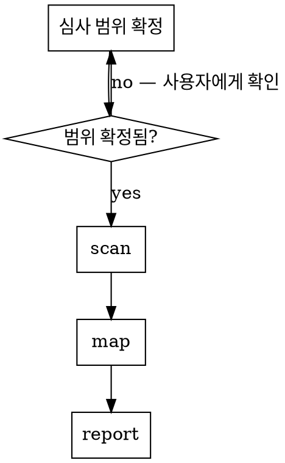

# ISMS 심사 대응

## Overview

**스캐너가 사실을 만들고, Claude는 매핑·통합·문서화만 한다.**

Claude는 결함 여부를 판정하지 않는다. 판정은 사람 몫. Claude 산출물은 항상
"검토 필요 항목 + 근거(체크 ID, 리소스 ARN)" 형태이고, 결함/개선/해당없음
확정은 담당자가 한다. 이 경계를 넘으면 심사에서 근거 없는 자체판정이 되어
오히려 감점 사유가 된다.

## When to Use

- ISMS / ISMS-P 인증심사 준비, 사후심사, 갱신심사
- 인프라·레포 전수 보안 점검 후 인증기준 매핑이 필요할 때
- 미흡사항 조치계획 문서를 만들 때
- 개인정보 흐름도(ISMS-P 3.x)를 코드에서 추출할 때

**쓰지 말 것:** 변경분(diff) 단위 리뷰 — 그건 `/security-review`나
`pr-review-toolkit`. ISMS는 posture 전수 축이라 diff 스킬과 축이 다르다.

## 순서 — 범위 확정이 항상 먼저

**범위를 모른 채 우선순위를 매기지 말 것.** 스캔 결과엔 dev/staging 리소스가
대량 섞여 들어온다. 운영 환경만 심사 범위인지, 계정 전체인지에 따라 Critical
목록이 통째로 바뀐다. 확정 전이면 사용자에게 묻는다.

## Phase 1 — scan

전용 스캐너로만 수집. Claude가 grep으로 대체하지 않는다.
검증된 명령·플래그는 `scanners.md` 참조.

| 대상 | 도구 | 산출 |
| --- | --- | --- |
| AWS | Prowler (`kisa_isms_p_2023_korean_aws`) | 인증기준 매핑 CSV 동시 생성 |
| 시크릿 | gitleaks (`--log-opts="--all"`) | git 히스토리 포함 |
| 코드 | Semgrep (`p/owasp-top-ten`) | SAST |
| 의존성·IaC | Trivy (`vuln,secret,misconfig`) | CVE + 오설정 |

스캔 전 필수: `aws sts get-caller-identity`로 대상 계정 확인.
스캔은 오래 걸리니 `run_in_background: true`.

## Phase 2 — map (여기서 대부분 틀린다)

스캐너 raw 출력은 그대로 쓰면 무조건 오독한다. 세 가지 보정을 반드시 거친다.

**① findings 수 ≠ 문제 수.** findings는 리소스별 발생 건수다. 먼저 고유
CHECK_ID로 접어라. 실측 예: FAIL 4,606건 → 고유 체크 233개.

**② 인증기준 섹션 합계를 더하지 마라.** 한 findings가 여러 인증기준에 동시
매핑된다. 섹션별 FAIL을 합산하면 전체 FAIL의 2배가 나온다. 중복 계산이다.

**③ 근본 원인으로 접어라 — 조치 효율의 핵심.** 실측 예: 보안그룹
`sg-...` 1개가 전체 포트를 열어 EC2 5대 × 포트 체크 17종 = Critical 85건을
만들었다. 리포트에 "Critical 85건"이라 쓰면 무의미하고, "SG 1개 수정 → 85건
해소"라고 써야 실제 조치가 된다. 항상 리소스 ARN으로 묶어 원인을 찾아라.

## Phase 3 — report

- 인증기준별로 묶고, 각 항목에 **체크 ID + 리소스 ARN** 근거를 붙인다
- 상태는 `검토 필요`로 낸다. `결함`으로 단정하지 않는다
- 오탐 가능 항목은 별도 표시 (아래 참조)
- Notion 기록 시 `knowledge:tdr` 또는 프로젝트 진행 DB 규칙 따름

## 개인정보 흐름도 (ISMS-P 3.x)

스캐너가 못 하는 유일한 영역이자 Claude의 실제 가치.
"이 컬럼이 개인정보인가"는 코드 이해가 필요하다.

code-review-graph MCP 우선 (`query_graph`, `semantic_search_nodes`) →
모델 필드 → DB 컬럼 → API 응답 경로를 추적해 수집·보관·파기 단계를 만든다.
Grep은 graph가 못 잡을 때만.

## Common Mistakes

| 실수 | 결과 | 대신 |
| --- | --- | --- |
| 출력 CSV/JSON을 Read로 열기 | 컨텍스트 폭발 (실측 920MB) | 스크립트로 집계 → 작은 JSON → Read |
| 프레임워크 키를 추측 | 스캔 실패, 시간 낭비 | `--list-compliance \| grep -i isms` 먼저 |
| 플래그 추측하고 장시간 실행 | 30분 뒤 에러 | `--help`로 검증 후 실행 |
| 시크릿 탐지 결과를 유출로 단정 | 오탐 대량, 신뢰 상실 | 정규식 기반임을 명시, 개별 검증 후 확정 |
| root 자격증명으로 스캔하고 넘어감 | 그 자체가 2.5.5 결함 | 발견 즉시 별도 조치 항목으로 올림 |
| Critical 건수로 우선순위 | 조치 대상 오판 | 근본 원인 단위로 접은 뒤 우선순위 |

## Red Flags — 멈추고 재확인

- "결함입니다" / "위반입니다" 라고 쓰고 있다 → `검토 필요`로 바꿔라
- 섹션별 FAIL을 더하고 있다 → 중복 계산이다
- 심사 범위를 안 물어보고 우선순위를 매기고 있다 → 먼저 물어라
- 스캐너 없이 grep으로 취약점을 찾고 있다 → 전용 도구를 써라
- 시크릿 탐지 결과를 검증 없이 목록으로 내고 있다 → 오탐 경고를 붙여라

## Boundaries

- 스캔은 **read-only**. describe/list/get만. 리소스 변경 금지.
- IAM 사용자·정책 생성 등 mutating 조치는 `infra-safety-gate` 경유.
- findings에 실제 시크릿 값이 포함될 수 있다. 리포트·Notion에 원문 값을
  옮기지 말고 리소스 식별자만 기록한다.
